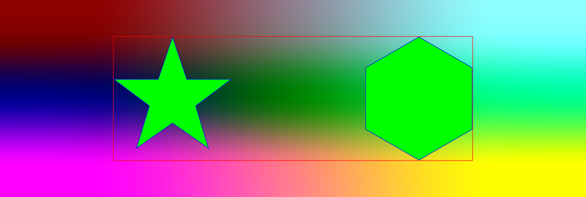

# SVG Writer

A MATLAB class to write SVG files.

## Getting started

Make sure the directory in which `@SVGWriter` is located (not the class directory itself) is on the MATLAB path.
A good default place to put it is `userpath` (on Windows `C:\Users\YOU\Documents\MATLAB` by default).

## Example

The class has a few methods to make it easy for the user.

```matlab
writer = SVGWriter();
writer.add_image(im); % add an image as background
writer.add_polygon(poly); % draw a polygon on top
writer.write('image_and_polygon.svg'); % write to file
```

See the script `./example.m` for a more elaborate example, which generated this graphic:


